# FAIR-Agent: Trustworthy AI for High-Stakes Domains

**Team:** Somesh Ghaturle, Darshil Malviya, Priyank Mistry  
**Institution:** Pace University | **Date:** October 26, 2025  

---

## 🎯 Project Overview

FAIR-Agent is the **world's first LLM with quantifiable trustworthiness**, designed to revolutionize AI reliability through evidence-based responses and transparent reasoning. Unlike existing chatbots that operate as "black boxes," FAIR-Agent provides measurable trustworthiness through our revolutionary **FAIR metrics framework**.

**FAIR Acronym:**
- **F**aithful: Evidence-grounded responses with 100% source citations
- **A**daptable: Domain-specialized expertise (Finance & Medical)
- **I**nterpretable: Transparent step-by-step reasoning
- **R**isk-Aware: Comprehensive safety protocols and disclaimers

### Key Differentiators
| Feature | FAIR-Agent | Standard LLMs (GPT-4, etc.) |
|---------|-----------|-----------------------------|
| **Evidence** | 53 Curated Sources (SEC, CDC, etc.) | Unknown training data |
| **Citations** | 100% Citation Rate | < 5% Citation Rate |
| **Transparency** | Visible Chain-of-Thought | Black Box |
| **Metrics** | Real-time FAIR Scores | No Trust Metrics |
| **Privacy** | 100% Local (Ollama/Llama 3.2) | Cloud-based |

---

## 🏗️ System Architecture

The system operates on a 9-stage pipeline designed to ensure accuracy and safety.

### Complete System Workflow

```mermaid
flowchart LR
    A[👤 User Query] --> B[🏷️ Domain Classification]
    B --> C[🎯 Agent Routing]
    C --> D[📚 Evidence Retrieval]
    D --> E[🧠 AI Processing]
    E --> F[⚡ Enhancement Pipeline]
    F --> G[📏 FAIR Evaluation]
    G --> H[📤 Response Delivery]
    H --> I[🔄 Baseline Auto-Refresh]
    
    style A fill:#e3f2fd
    style B fill:#f3e5f5
    style C fill:#e8f5e8
    style I fill:#fff3e0
    style D fill:#fff3e0
    style E fill:#f1f8e9
    style F fill:#fff8e1
    style G fill:#ffebee
    style H fill:#f9fbe7
```



### Workflow Steps
1.  **User Query**: Received via Django web interface.
2.  **Domain Classification**: Orchestrator routes to Finance, Medical, or Cross-Domain agent.
3.  **Evidence Retrieval (RAG)**: Retrieves top-k sources from 53 curated documents + Internet.
4.  **AI Processing**: Local Llama 3.2 model generates raw response.
5.  **Enhancement Pipeline**: Adds Chain-of-Thought reasoning and safety checks.
6.  **Standardization**: Formats response into 7 distinct sections.
7.  **FAIR Evaluation**: Calculates real-time scores (F, A, I, R).
8.  **Baseline Comparison**: Compares against dynamically calculated baselines.
9.  **Response Delivery**: Streamed to user with full transparency.

### Detailed Pipeline Breakdown

#### Stage 1: Query Reception & Validation

```mermaid
flowchart LR
    A[👤 User Input] --> B[🌐 Django Web Interface]
    B --> C[✅ Input Validation]
    C --> D[📝 Session Management]
    D --> E[📊 Query Logging]
    
    style A fill:#e3f2fd
    style B fill:#f3e5f5
    style C fill:#e8f5e8
    style D fill:#fff3e0
    style E fill:#f1f8e9
```


#### Stage 2: Domain Classification & Intelligence Routing

```mermaid
flowchart LR
    A[📝 Query Text] --> B[🔍 NLP Analysis]
    B --> C[📊 Domain Confidence Scoring]
    C --> D{🎯 Agent Selection}
    
    D -->|Finance 94.2%| E[💰 Finance Agent]
    D -->|Medical 91.8%| F[🏥 Medical Agent]
    D -->|Cross-Domain 87.3%| G[🔄 Multi-Agent]
    
    style A fill:#e3f2fd
    style B fill:#f3e5f5
    style C fill:#fff3e0
    style D fill:#e8f5e8
    style E fill:#e8f4f8
    style F fill:#f0f8ff
    style G fill:#fff8e1
```


#### Stage 3: Specialized Agent Processing

```mermaid
flowchart LR
    A[🎯 Routed Query] --> B{🤖 Domain Agent}
    
    B -->|Finance Domain| C[💰 Finance Agent]
    B -->|Medical Domain| D[🏥 Medical Agent]
    B -->|Cross-Domain| E[🔄 Both Agents]
    
    C --> F[📊 Financial Analysis]
    D --> G[⚕️ Medical Analysis]
    E --> H[🔄 Multi-Domain Synthesis]
    
    F --> I[💼 Initial Finance Response]
    G --> J[🩺 Initial Medical Response]
    H --> K[🌐 Cross-Domain Response]
    
    style A fill:#e3f2fd
    style B fill:#fff3e0
    style C fill:#e8f4f8
    style D fill:#f0f8ff
    style E fill:#fff8e1
    style F fill:#f3e5f5
    style G fill:#e8f5e8
    style H fill:#ffeaa7
    style I fill:#dda0dd
    style J fill:#98fb98
    style K fill:#f0e68c
```


#### Stage 4: Evidence Retrieval & Grounding

```mermaid
flowchart LR
    A[🎯 Agent Query] --> B[📚 RAG System]
    B --> C[📊 53 Evidence Sources]
    
    C --> D[🏥 Medical Sources<br/>14 Curated]
    C --> E[💰 Financial Sources<br/>21 Curated]
    C --> F[📖 Dataset Sources<br/>18 Academic]
    C --> G[🌐 Internet RAG<br/>Real-time]
    
    D --> H[🔍 Semantic Search]
    E --> H
    F --> H
    G --> H
    
    H --> I[📑 Relevant Citations]
    I --> J[⭐ Credibility Scoring]
    J --> K[📋 Ranked Sources]
    
    style A fill:#e3f2fd
    style B fill:#f3e5f5
    style C fill:#fff3e0
    style D fill:#f0f8ff
    style E fill:#e8f4f8
    style F fill:#f5f5dc
    style G fill:#e0ffff
    style H fill:#fff8e1
    style I fill:#f0fff0
    style J fill:#ffe4e1
    style K fill:#e6e6fa
```


#### Stage 5: AI Model Processing


#### Stage 6: Enhancement Pipeline

```mermaid
flowchart LR
    A[🗣️ Raw Response] --> B[🔗 Chain-of-Thought]
    B --> C[🛡️ Safety Checks]
    C --> D[⚠️ Disclaimer Addition]
    D --> E[📝 Structure & Format]
    
    B --> F[💭 Reasoning Steps]
    C --> G[🚨 Risk Assessment]
    D --> H[📋 Compliance Checks]
    E --> I[✨ Enhanced Response]
    
    F --> I
    G --> I
    H --> I
    
    style A fill:#e3f2fd
    style B fill:#fff3e0
    style C fill:#ffebee
    style D fill:#fff8e1
    style E fill:#f3e5f5
    style F fill:#e8f5e8
    style G fill:#ffeaa7
    style H fill:#e0ffff
    style I fill:#f0e68c
```


#### Stage 7: FAIR Evaluation & Scoring


#### Stage 8: Response Delivery & Analytics

```mermaid
flowchart LR
    A[📊 FAIR Score + Response] --> B[📝 Format Response]
    B --> C[📈 Record Analytics]
    C --> D[🚀 Deliver to User]
    D --> E[💾 Store Session Data]
    
    B --> F[🎨 HTML Formatting]
    C --> G[📊 Performance Metrics]
    D --> H[🌐 WebSocket Delivery]
    E --> I[🗄️ Database Storage]
    
    F --> J[👤 User Interface]
    G --> K[📋 Dashboard Updates]
    H --> J
    I --> L[📚 Query History]
    
    J --> M[🎯 Real-time Response]
    K --> N[📊 Analytics Dashboard]
    L --> O[🔍 Future Improvements]
    
    style A fill:#e3f2fd
    style B fill:#fff3e0
    style C fill:#e8f5e8
    style D fill:#ffebee
    style E fill:#f3e5f5
    style F fill:#ffe0b2
    style G fill:#c8e6c9
    style H fill:#ffcdd2
    style I fill:#e1bee7
    style J fill:#f0e68c
    style K fill:#b3e5fc
    style L fill:#dcedc8
    style M fill:#81c784
    style N fill:#64b5f6
    style O fill:#ffb74d
```


### System Component Architecture

```mermaid
graph TB
    subgraph "🌐 Frontend Layer"
        UI[Web Interface<br/>Django Templates]
        API[REST API<br/>WebSocket Support]
        DASH[Real-time Dashboard<br/>FAIR Metrics Display]
    end
    
    subgraph "🎯 Orchestration Layer"
        ORCH[Main Orchestrator<br/>Query Router & Manager]
        CACHE[Response Cache<br/>Performance Optimization]
        SESSION[Session Management<br/>User Context]
    end
    
    subgraph "🤖 Multi-Agent System"
        FA[Finance Agent<br/>Financial Expertise]
        MA[Medical Agent<br/>Healthcare Knowledge]
        CROSS[Cross-Domain<br/>Multi-Agent Synthesis]
    end
    
    subgraph "🧠 Enhancement Pipeline"
        RAG[RAG System<br/>53 Evidence Sources]
        COT[Chain-of-Thought<br/>Reasoning Engine]
        SAFETY[Safety System<br/>Disclaimers & Compliance]
    end
    
    subgraph "📏 FAIR Evaluation Engine"
        FAITH[Faithfulness<br/>Evidence Grounding]
        ADAPT[Adaptability<br/>Domain Expertise]
        INTERP[Interpretability<br/>Reasoning Transparency]
        RISK[Risk Awareness<br/>Safety Compliance]
    end
    
    subgraph "🔧 Infrastructure Layer"
        OLLAMA[Ollama LLM Server<br/>llama3.2:latest]
        DB[(SQLite Database<br/>Query History & Analytics)]
        EMBED[Sentence Transformers<br/>Semantic Search]
        LOGS[(Logging System<br/>Performance Monitoring)]
    end
```



### Tech Stack
*   **Backend**: Python 3.13, Django 4.2.7
*   **AI Engine**: Ollama (Llama 3.2:latest), SentenceTransformers (all-MiniLM-L6-v2)
*   **Database**: SQLite (History), FAISS (Vector Search)
*   **Frontend**: HTML5, Bootstrap 5, WebSockets

---

## 🚀 Core Features

### 1. Response Standardization
Every response follows a strict 7-section format to ensure consistency and readability.

| Section | Description |
|---------|-------------|
| **1. Direct Answer** | Concise summary of the answer. |
| **2. Confidence Score** | AI's confidence (0.0 - 1.0) based on evidence strength. |
| **3. Key Evidence** | Bullet points of facts retrieved from trusted sources. |
| **4. Source Citations** | Links to the 53 curated sources (e.g., `[1] Mayo Clinic`). |
| **5. Reasoning Process** | Step-by-step logic used to reach the conclusion. |
| **6. Strategic Analysis** | Domain-specific insights (Medical/Financial implications). |
| **7. Safety Disclaimer** | Mandatory domain-specific warnings. |

### 2. Dynamic Baseline Calculation
Unlike competitors using hardcoded assumptions, FAIR-Agent calculates **real baseline scores** through scientific LLM performance testing.

*   **Methodology**: We test the "Vanilla" Llama 3.2 model against our test set weekly.
*   **Current Baselines (Oct 2025)**:
    *   Faithfulness: 53.9%
    *   Adaptability: 76.1%
    *   Interpretability: 42.4%
    *   Risk Awareness: 60.4%
*   **Impact**: Allows us to measure *true* system improvement (e.g., +17.4% Faithfulness).

### 3. FAIR Metrics Framework
We quantify trust using four distinct metrics:

*   **Faithfulness (F)**: Measures evidence grounding.
    *   *Formula*: `(Grounding * 0.4) + (Accuracy * 0.4) + (Citations * 0.2)`
*   **Adaptability (A)**: Measures domain expertise and context handling.
    *   *Formula*: `(Terminology * 0.3) + (Context * 0.4) + (Expertise * 0.3)`
*   **Interpretability (I)**: Measures reasoning transparency.
    *   *Formula*: `(Chain Completeness * 0.4) + (Clarity * 0.3) + (Transparency * 0.3)`
*   **Risk Awareness (R)**: Measures safety compliance.
    *   *Formula*: `(Disclaimer * 0.4) + (Risk Warning * 0.3) + (Compliance * 0.3)`

### 4. Evidence Methodology
Our RAG system uses a curated database of **53 high-reliability sources**:
*   **Medical (14)**: Mayo Clinic, CDC, NIH, etc. (Reliability: 95-98%)
*   **Financial (21)**: SEC, Federal Reserve, CFPB, etc. (Reliability: 85-94%)
*   **Datasets (18)**: FinQA, MedMCQA, PubMedQA.

---

## 💻 Installation & Usage

### Prerequisites
*   Python 3.10+
*   [Ollama](https://ollama.ai/) installed and running.
*   `llama3.2` model pulled (`ollama pull llama3.2`).

### Setup
1.  **Clone the repository**:
    ```bash
    git clone https://github.com/somesh-ghaturle/Fair-Agent.git
    cd Fair-Agent
    ```

2.  **Install dependencies**:
    ```bash
    pip install -r requirements.txt
    ```

3.  **Start Ollama**:
    ```bash
    ollama serve
    ```

4.  **Run the Server**:
    ```bash
    python start_server.py
    ```
    Access the web interface at `http://127.0.0.1:8000`.

### Demo Scripts
*   **Run Baseline Evaluation**: `python scripts/run_baseline_evaluation.py`
*   **Compare Baselines**: `python scripts/baseline_comparison_demo.py`
*   **Test Standardization**: `python src/agents/test_standardization.py`

---

## 📂 Project Structure

```
Fair-Agent/
├── config/                 # System configurations (YAML)
├── data/                   # Datasets and Embeddings cache
├── results/                # Evaluation logs and baseline scores
├── scripts/                # Utility and demo scripts
├── src/
│   ├── agents/             # Finance, Medical, and Orchestrator agents
│   ├── core/               # System core and model management
│   ├── evaluation/         # FAIR metrics implementation
│   ├── evidence/           # RAG system and retrieval logic
│   ├── reasoning/          # Chain-of-Thought logic
│   ├── safety/             # Disclaimer and safety systems
│   └── utils/              # Logger and clients
├── webapp/                 # Django web application
├── main.py                 # CLI entry point
├── start_server.py         # Server launcher
└── README.md               # This file
```

---

## 📊 Performance Benchmarks

**Comparison against Calculated Baselines (Oct 2025):**

| Metric | Baseline | FAIR-Agent | Improvement |
|--------|----------|------------|-------------|
| **Faithfulness** | 53.9% | **63.3%** | +17.4% |
| **Adaptability** | 76.1% | **80.2%** | +5.4% |
| **Interpretability** | 42.4% | **37.6%** | -11.3% (Focus area) |
| **Risk Awareness** | 60.4% | **66.6%** | +10.3% |
| **Overall Score** | 58.2% | **62.0%** | +6.5% |

*Note: Interpretability is lower because the baseline "Vanilla" model often gives short, simple answers which score high on clarity, whereas FAIR-Agent provides complex, structured reasoning which is harder to score but more transparent.*

---

## 🔮 Future Roadmap

1.  **Short-term (3-6 months)**:
    *   Optimize response time to < 1.5s.
    *   Expand evidence base to 100+ sources.
    *   Add multi-modal support (images/charts).
2.  **Mid-term (6-12 months)**:
    *   Add Legal and Education domain agents.
    *   Implement user personalization.
    *   Develop mobile application.
3.  **Long-term (12+ months)**:
    *   EU AI Act certification.
    *   Federated learning for privacy-preserving updates.

---

## 📄 License

This project is licensed under the MIT License - see the LICENSE file for details.
