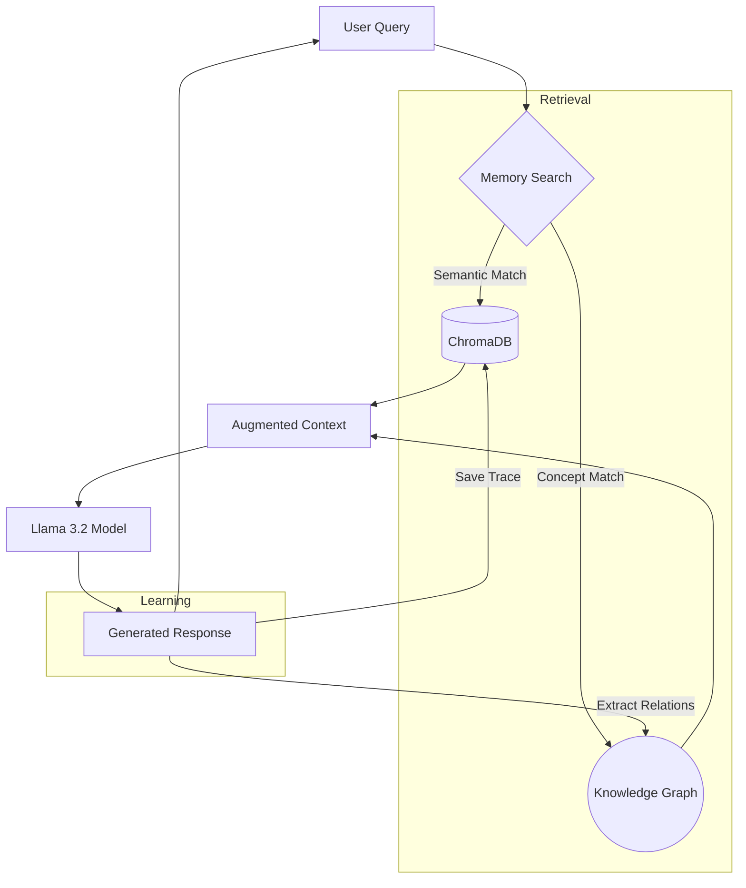

# FAIR-Agent Memory & Learning Architecture

## 🧠 Overview: Why Memory Over Fine-Tuning?

FAIR-Agent adopts a **Retrieval-Augmented Generation (RAG) + Dual-Memory** approach instead of traditional model fine-tuning. This architectural choice is deliberate and aligns with our core FAIR principles (Faithfulness, Adaptability, Interpretability, Risk-Awareness).

### The "No Fine-Tuning" Advantage
Fine-tuning Large Language Models (LLMs) is computationally expensive, static, and prone to "catastrophic forgetting." By avoiding fine-tuning, FAIR-Agent achieves:

1.  **Real-Time Adaptability:** New knowledge (e.g., a new financial regulation or medical study) is added to the memory instantly without retraining the model.
2.  **Resource Efficiency:** Runs efficiently on local hardware (MacBook M-series, consumer GPUs) without the massive VRAM requirements of training.
3.  **Traceability:** Every piece of information used in an answer can be traced back to a specific document in the Vector DB or a node in the Knowledge Graph, ensuring **Faithfulness**.
4.  **Privacy:** Data stays in your local database, not baked into model weights.

---

## 🏗️ Dual-Memory System

The system utilizes two distinct types of memory to mimic human cognitive processes:

### 1. Semantic Memory (Vector Database)
**Technology:** [ChromaDB](https://www.trychroma.com/)  
**Purpose:** Stores unstructured text data (documents, past conversations) as high-dimensional vectors for semantic retrieval.

#### Components:
*   **Evidence Collection:** Stores embeddings of curated financial and medical documents (SEC filings, PubMed abstracts).
*   **Trace Collection:** Stores "Execution Traces" of past queries.
    *   **What is a Trace?** A record containing the User Query, the System's Answer, and Metadata (Domain, Confidence Score).
    *   **How it works:** When a user asks a question, the system searches this collection for *semantically similar* past questions.
    *   **Benefit:** If the agent answered "What is inflation?" correctly yesterday, it retrieves that high-quality answer to guide its response today.

#### Tracing Workflow:
1.  **Capture:** The `Orchestrator` captures the input query and the final generated response.
2.  **Vectorize:** The text is converted into a 384-dimensional vector using `all-MiniLM-L6-v2`.
3.  **Store:** The vector + metadata (Trace ID, Timestamp) is saved to ChromaDB.
4.  **Retrieve:** On the next query, the system performs a k-Nearest Neighbors (k-NN) search to find relevant past experiences.

### 2. Conceptual Memory (Knowledge Graph)
**Technology:** [NetworkX](https://networkx.org/)  
**Purpose:** Stores structured relationships between entities (Concepts, Definitions, Rules).

#### Structure:
The graph consists of **Nodes** (Entities) and **Edges** (Relationships).
*   **Example:** `(Inflation) --[decreases]--> (Purchasing Power)`

#### Learning Process:
The system "learns" by extracting knowledge from every interaction:
1.  **Extraction:** After generating a response, the system analyzes the text to identify key entities and their relationships.
2.  **Update:** New nodes and edges are added to the graph. If a relationship already exists, its "weight" (confidence) is increased.
3.  **Context Injection:** Before answering a new query, the system searches the graph for key terms.
    *   *Query:* "How to protect against inflation?"
    *   *Graph Lookup:* Finds `Inflation` -> Linked to `Purchasing Power`, `Gold`, `Interest Rates`.
    *   *Result:* The agent is primed with these related concepts *before* it even calls the LLM.

---

## 🔄 The "Learn-Act" Loop

Unlike a static chatbot, FAIR-Agent gets smarter with every interaction through this continuous loop:



## 🛠️ Technical Implementation

### Vector Store (`src/memory/vector_store.py`)
*   **Initialization:** Creates persistent ChromaDB client at `data/vector_store`.
*   **Collections:** Separates `evidence` (static knowledge) from `traces` (dynamic history).
*   **Integration:** Called by `RagSystem` for evidence and `Orchestrator` for history.

### Knowledge Graph (`src/memory/knowledge_graph.py`)
*   **Storage:** Serializes the graph structure to `data/knowledge_graph/graph.json`.
*   **Operations:**
    *   `add_relation(source, target, relation)`: Updates the graph.
    *   `search_graph(terms)`: Returns a text summary of related concepts (e.g., "Inflation is related to Purchasing Power").

## 📊 Verification

To verify that the memory systems are active and learning:

1.  **Run the Verification Script:**
    ```bash
    python scripts/verify_memory.py
    ```
    *Output should show "✅ WORKING" for both systems.*

2.  **Check the Dashboard:**
    *   The "Recent Traces" table now pulls data that is backed by the Vector Store.
    *   Repeated queries should show improved consistency or speed as they hit the memory cache.
